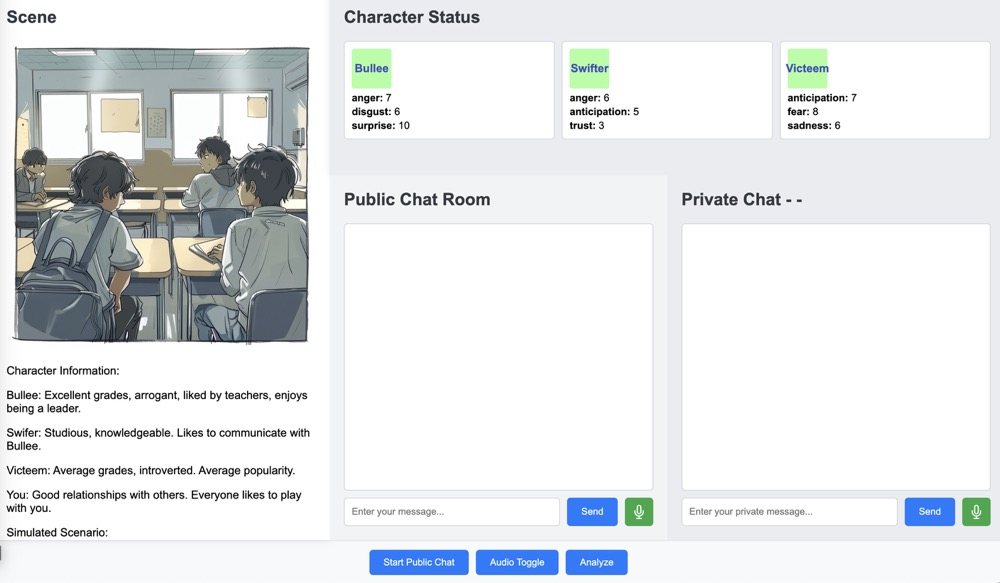

# HeroYouth: Empowering Youth Against School Bullying
The first Multi-Agent Simulation System designed to enhance teenagers' bully intervention abilities. Co-designed with middle school teachers, it leverages their experience and insights about real-world school bullying dynamics to build a vivid bullying scenarios for anti-bullying training purpose. 




# How to Start

## Create Virtual Environment
First, create and activate a virtual environment to isolate project dependencies:

### On Windows:
```powershell
# Create virtual environment
python -m venv venv

# Activate virtual environment
.\venv\Scripts\activate
```

### On macOS/Linux:
```bash
# Create virtual environment
python -m venv venv

# Activate virtual environment
source venv/bin/activate
```

## Install Dependencies
After activating your virtual environment, install the required packages:

```bash
pip install -r requirements.py
```

## Setup LLMs 
set up your models and apis in config/OAI_CONFIG_LIST

```
[
    {
        "model": "gpt-3.5-turbo-0125",
        "api_key": "sk-***",
        "base_url": "**" 
    },
    {
        "model": "gpt-4o",
        "api_key": "sk-***",
        "base_url": "**"
    },
    {
        "model": "gpt-4o-mini",
        "api_key": "sk-***",
        "base_url": "**"
    },
    {
        "model": "deepseek-chat",
        "api_key": "sk-**",
        "base_url": "**"
    }
]

```
You can add other models with api_key and base_url.


## Setup AZURE_CONFIG
Our system support audio input. Set up your AZURE_SPEECH_KEY, AZURE_SPEECH_REGION, AZURE_SPEECH_LANGUAGE in ./config/AZURE_CONFIG

'''
{
    "AZURE_SPEECH_KEY": **,
    "AZURE_SPEECH_REGION": **,
    "AZURE_SPEECH_LANGUAGE": **
}
'''

## Config Character Profiles
Currently, we support three AI characters in the conversation.
You can modify their profiles in ./character folder.

You can also add more characters according to your scenario by add new character yaml. 


## Start Server
The python backend server is driven by [AG2 (Formerly AutoGen)](https://ag2.ai/), an opensource multi-agent framework. 
Start it by 

```python 
python app.py
```
The default port is at localhost:5001


## Build with AG2
This project is built with [AG2 (Formerly AutoGen)](https://ag2.ai/)

### ProactGroupAgent based on AssistantAgent
The ProactGroupAgent is built upon AssistantAgent of AG2, which enables it can register_reply and register_hook easily. 
We add a_update_inner_state method into the _reply_func_list, so that every time before ProactGroupAgent responds, it will update its inner state first.


### Sequential Chat as Inner Cognitive Architecture 
We implement the cognitive architecture of each AI character by sequential chat feature in AG2, which provides an easy way to make each inner module pluggable.
```python
self.module_sequence = [
            {
               "chat_id": 0,
                "recipient": SummaryModuleAgent,
                "clear_history": True,
                "max_turns": 1,
                "silent": True,
                "summary_method": "last_msg",
                "llm_config": llm_config_gpt4omini
            },
            {   
                "chat_id": 1,
                "prerequisites": [7],
                "recipient": EmotionModuleAgent,
                "clear_history": True,
                "max_turns": 1,
                "silent": True,
                "summary_method": "last_msg",
                "llm_config": llm_config_gpt4omini
            },
            {
                "chat_id": 2,
                "prerequisites": [3,4],
                "recipient": PauseModuleAgent,
                "clear_history": True,
                "max_turns": 1,
                "silent": True,
                "summary_method": "last_msg",
                "llm_config": llm_config_gpt4omini
            },
            ...
]
```

### hook for flexible functionality 
For the implementation of inner_modules, we add a chain of functions to post process the message each CognitiveModuleAgent generates, e.g. add necessary keys-values into the response dict and store message locally. 

```python

class CognitiveModuleAgent(AssistantAgent):
    '''
    The cognitive module is an LLM agent with a specific cognitive funciton. 
    Its function and return format is defined in functional_prompt. And it only response once, no conversation.
    It has a function chain to process the response.
    '''
    def __init__(self, functional_prompt:BasePrompt, *args, **kwargs):
        super().__init__(
            # max_consecutive_auto_reply=2,
            *args, **kwargs)
        self.logger = shared_logger 
        self.functional_prompt:BasePrompt = functional_prompt()
        self.function_chain = FunctionChain()
        self.function_chain.add(self.load_message)
        self.function_chain.add(self.data_store)
        self.register_hook('process_message_before_send', CognitiveModuleAgent.post_chats_functions)

```

Check out more projects built with AG2 at [Build with AG2](https://github.com/ag2ai/build-with-ag2)!


# TODO
RealTime audio interaction. For better training effects and engagement, realtime audio interaction is necessary. We will further implement it by AG2 api. 

# License
This project is licensed under the Creative Commons Attribution-NonCommercial (CC BY-NC) License.

This means you are free to:
- Share — copy and redistribute the material in any medium or format
- Adapt — remix, transform, and build upon the material

Under the following terms:
- Attribution — You must give appropriate credit, provide a link to the license, and indicate if changes were made.
- NonCommercial — You may not use the material for commercial purposes.

For more information, see the [Creative Commons BY-NC License](https://creativecommons.org/licenses/by-nc/4.0/).
